# Portal Hunt

'Portal Hunt' is a text-based adventure game that challenges players to navigate the various paths within the fictional realm to find a portal that will take them home, winning the game. Along these paths, players will need to search for various items that are required to fight the variety of enemies they will encounter along their journey. View the live site [here](https://portal-hunt-6b8f218a5854.herokuapp.com/).

## Features

### Main Menu

* The program begins at a main menu, introducing the player to the game and explaining the aim of their 'quest'; to find a portal that will take them home.
* A message prompts the user to input 'start' to begin the game.

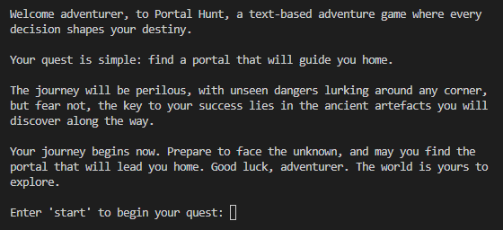

### The Glade

* 'The Glade' provides a central position within the game, allowing the users the option to travel any direction to a path of their choosing;
    * North: Mountains path
    * East: Caves path
    * South: Scorchlands path
    * West: Wetlands path
* This block includes a brief description of the area and a poem that hints on what is to come.
* A message prompts the user to input a direction from the available options above to proceed to the next block.

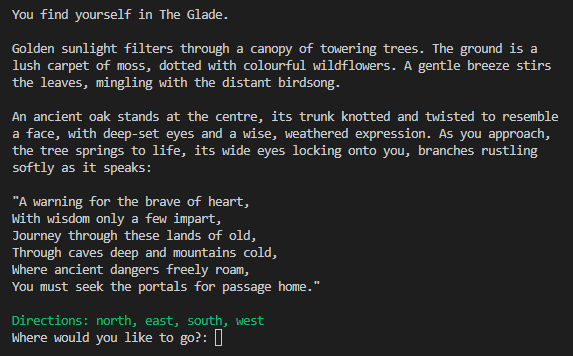

### Biome Description

* Whichever path the player chooses to follow, after leaving 'The Glade' they will enter a 'biome description' block.
* This block provides a description of the area, or biome, in which the chosen path is set, all of the items and enemies within each path follow that same theme.
* A message prompts the user to input a direction from the available options above to proceed to the next block.

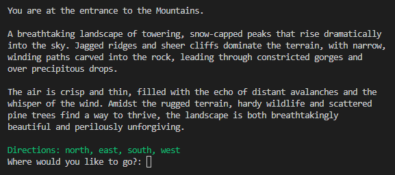

### Crossroads & Dead Ends

* 'Crossroads' and 'Dead End' blocks are used throughout each path to space out the item and enemy blocks, providing a challenge for the player to navigate between them.
* These include a generic message that is the same for every path, as they are not intended to provide any import interactive element.
* A message prompts the user to input a direction from the available options above to proceed to the next block.

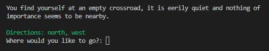

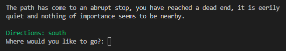

### Items

Within each path, three items must be found in order to successfully reach the portal, the interaction with these blocks is dependent on if the item exists within the players 'inventory' or not.

#### New Item

* If the item does not exist within the inventory, it is treated as a new item.
* A description of the location and the item is provided.
* A message prompts the user to input a choice to either 'take' or 'leave' the item. Inputting 'take' will add the item to the inventory and print a short confirmation that the item was taken. Inputting 'leave' will not amend the inventory and will print a short confirmation that the item was left. 
* After the choice is made, a message prompts the user to input a direction from the available options to proceed to the next block.

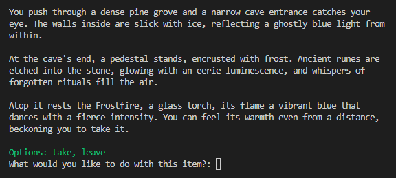

#### Existing Item

* If the player has previously visited the item block and chosen to take it, revisiting the block will treat it as an existing item.
* A different description of the location is provided, with a slightly more depressing undertone.
* A message prompts the user to input a choice to either 'keep' or 'return' the item. Inputting 'return' will remove the item to the inventory and print a short confirmation that the item was returned. Inputting 'keep' will not amend the inventory and will print a short confirmation that the item was kept.
* After the choice is made, a message prompts the user to input a direction from the available options to proceed to the next block.

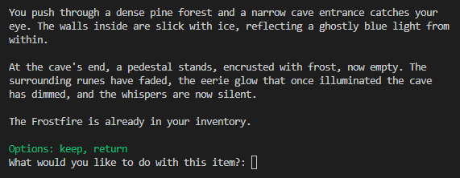

### Enemies

Within each path, four enemies exist, at least three of which must be fought in order to successfully reach the portal, certain items are required to defeat each one. The interaction with these blocks is dependent on if the enemy is 'alive' or 'dead'.

There are three difficulty levels to these enemies;
* Two are level 1, only requiring the player to have the level 1 item to win the fight, getting past either of these enemies will allow the player to find the level 2 item.
* The level 2 enemy requires the player to have both the level 1 and 2 items to win the fight, getting past this enemy will allow the player to find the level 3 item.
* The level 3 enemy requires the player to have the level 1, 2 and 3 items to win the fight, this enemy blocks the only way to that path's portal and a chance to win the game.

#### Enemy Description

* When first entering the block, players will be provided with a description of the enemy.
* A message prompts the user to input a choice to either fight or flee. Inputting 'fight' will check if the required items exist within the inventory and provide a result accordingly. Inputting 'flee' will return the player to the previous block, allowing them to continue their journey.

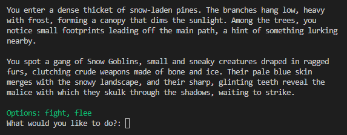

#### Player Defeated

* If the player chooses to fight the enemy and the required items are not in the inventory, the player will be defeated.
* A description of losing the fight is provided, including a message that that they were "not equipped" to defeat the enemy, hinting to the player that they need to find right items first.
* Losing a fight calls the 'game_over' function, allowing the player to return to the main menu or play again, resetting the game and returning them to 'The Glade' block.

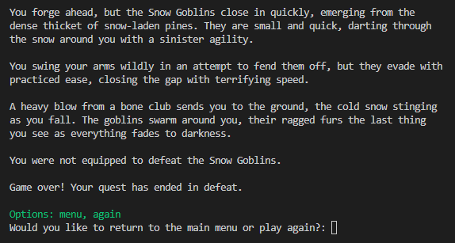

#### Player Victorious

* If the player chooses to fight the enemy and the required items are in the inventory, the player will be victorious, changing the value for that enemy in the 'enemies' dictionary to 'False'.
* A description of winning the fight is provided, including a message that they are now able to "travel through this area in peace".
* A message prompts the user to input a direction from the available options to proceed to the next block.

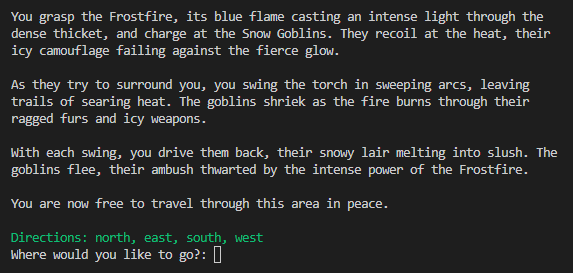

#### Enemy Cleared

* If the player returns to the enemy block, having previously defeated them (i.e. 'Enemy = False' in the 'enemies' dictionary), then the block will run an 'enemy cleared' scene.
* A description is given of the area and the aftermath of the fight, implying that it is now a safer place.
* A message prompts the user to input a direction from the available options above to proceed to the next block.

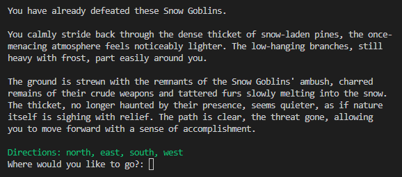

### Portal

* After defeating the level 3 enemy, the player is able to travel to the 'Portal' block, completing that path and the main way of winning the game.
* A description of the player finder the portal is provided as well as a message to congratulate them, remind them that there are multiple paths to take if they would like to play again and thank them for playing the game.
* Finding a portal calls the 'game_over' function, allowing the player to return to the main menu or play again, resetting the game and returning them to 'The Glade' block.

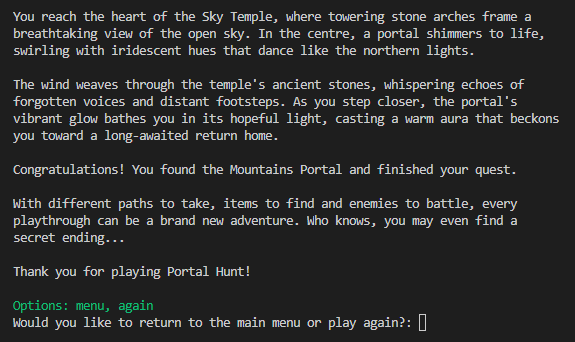